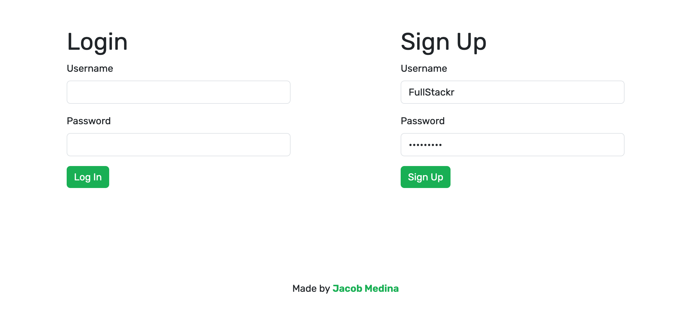

#  Stackology

## Description

[Click here to visit the live website.](https://stackology-ac660c15f415.herokuapp.com/)

A community run blog for full stack developers.

Stackology provides a space for full stack web developers to read and publish blog posts about the latest tools, techniques, tutorials for development. Users can build a following and discuss ideas in the comments section of each of their blog posts.

## Usage

A user may do the following:
- Resize the window to get a layout that is appropriate for the screen dimensions
- Click on a blog post to read its contents and comments
- Click the **"Write a Post"** or **"Login"** button to be brought to login page
- Sign Up with new credentials or login with a username and password

When logged in, a user may do the following:

- Click the **"Write"** button to write a new blog post
- Enter the blog post title, thumbnail URL, and content, then click the **"Post"** button to publish the blog post

- Write a comment on any blog post

- Click the **"Dashboard"** link to be brought to their dashboard, where their blog posts can be edited and deleted

- Click the **"Logout"** link to log out of their account

## Credits
- Seed Data: [ChatGPT](https://chat.openai.com)
- Default blog post thumbnail: [by pikisuperstar on Freepik](https://www.freepik.com/free-vector/isometric-people-working-with-technology_5083803.htm#query=digital%20transformation&position=19&from_view=search&track=ais)
- All thumbnail URLs used in this project are owned by their respective entities

## License

This project is made under the [MIT License](./LICENSE).